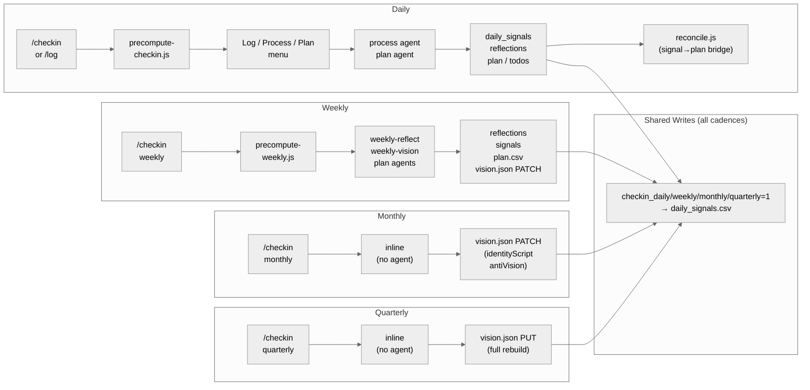

Status: shipped

# Feature: System Documentation Overhaul + Stale Code Cleanup

## Problem

```
PROBLEM:
- What: architecture.md is incomplete and stale; orphaned API routes and components exist in the codebase; CLAUDE.md has stale route references; brain-state skill references an archived agent
- Why: Research (research.md) confirmed 7 documentation gaps, 2 orphaned API routes, 1 orphaned component, 1 stale CLAUDE.md route reference, and 1 stale skill reference. A future agent or developer can't navigate the system from docs alone.
- User-facing effect: No runtime change. Docs become accurate; dead code is removed; architecture.md becomes the single source of truth for system navigation.
```

## Affected Files

```
SCOPE:
- Files to modify:
    docs/architecture.md                        (full rewrite, all content replaced)
    tracker/CLAUDE.md                           (remove stale /resources from routes list)
- Files to delete:
    app/app/api/groceries/route.ts              (orphaned — no page consumer)
    app/app/api/quotes/route.ts                 (orphaned — consumed only internally by /api/hub, no direct consumer)
    app/app/components/GroceryCard.tsx          (orphaned — no import found)
- Files to create: none
- Files that must NOT change:
    Any app/app/*/page.tsx
    app/app/lib/csv.ts
    app/app/lib/router.ts
    app/app/lib/config.ts
    Any agent .md file (agents/ directory)
    data/ directory (no CSV changes)
    docs/data-schemas.md
    docs/app-intent.md
    Any other file not listed above
```

## Visual Contract

Not applicable — no UI changes.

## Success Criteria

```
SUCCESS:
- [ ] Build passes (npm run build, zero errors) after deletions
- [ ] docs/architecture.md contains all 8 required sections (see Section Plan below)
- [ ] No reference to /resources route in tracker/CLAUDE.md routes list
- [ ] app/app/api/groceries/route.ts does not exist
- [ ] app/app/api/quotes/route.ts does not exist
- [ ] app/app/components/GroceryCard.tsx does not exist
- [ ] No files modified outside declared scope
```

## Failure Definitions

| Failure Type | Detection Method | Action |
|---|---|---|
| Build error after deletions | `npm run build` output | Trace import, fix or restore file |
| Section missing from architecture.md | Read the file, check all 8 headers | Add missing section |
| Stale /resources still in CLAUDE.md | Grep for `/resources` in CLAUDE.md routes list | Edit the routes list |
| File deleted that wasn't orphaned | `npm run build` import error | Restore file, re-audit consumers |
| File modified outside scope | `git diff --stat` | Revert unintended changes |

## Invariants

```
INVARIANTS:
- docs/data-schemas.md must not be touched (it is the canonical CSV schema reference)
- docs/app-intent.md must not be touched
- No page.tsx files may be modified
- No CSV data files may be modified
- agent .md files must not be modified (brain-state skill staleness is documented in architecture.md, not fixed there)
- The 4-layer model concept must be preserved in architecture.md (only the visual representation changes)
- All CSV file names in architecture.md must match the canonical list in CLAUDE.md
```

## Per-File Checkpoints

Before proceeding to the next file, answer for each:
1. Does this file reference only canonical vocabulary from CLAUDE.md and research.md?
2. Did the diff contain ONLY changes the spec asked for?
3. Can I trace every change to a specific spec item?
4. For deletions: did `npm run build` pass after the deletion?

## Diff Contract

### 1. `app/app/api/groceries/route.ts` — DELETE
- **WHAT**: Delete orphaned API route file
- **WHY**: Research Q7 confirmed no page consumer; groceries.csv is not part of any active page
- **PRESERVES**: nothing (file is deleted)
- **REMOVES**: full file
- **RISK**: if /api/hub or another route imports from this file, build will break. Verify with build after deletion.

### 2. `app/app/api/quotes/route.ts` — DELETE
- **WHAT**: Delete orphaned API route file
- **WHY**: Research Q7 confirmed no direct page consumer; quotes.csv is read internally by /api/hub without going through this route
- **PRESERVES**: nothing (file is deleted)
- **REMOVES**: full file
- **RISK**: if /api/hub imports from quotes/route.ts, build will break. Hub reads quotes.csv directly via csv.ts — confirm before deleting.

### 3. `app/app/components/GroceryCard.tsx` — DELETE
- **WHAT**: Delete orphaned component
- **WHY**: Design decision #3; no import found in research
- **PRESERVES**: nothing
- **REMOVES**: full file
- **RISK**: if any page.tsx or DayView.tsx imports GroceryCard, build will break. Grep for import before deleting.

### 4. `tracker/CLAUDE.md` — EDIT
- **WHAT**: Remove stale `/resources` entry from the routes list in the Current App Routes section
- **WHY**: Research Q5 confirmed /resources does not exist; it's stale documentation
- **PRESERVES**: all other content in CLAUDE.md
- **REMOVES**: the `/resources` bullet/line only
- **RISK**: low; documentation-only change

### 5. `docs/architecture.md` — FULL REWRITE
- **WHAT**: Delete all existing content, write 8-section architecture document
- **WHY**: Design decisions #1-5; research Q17 identified all missing sections
- **PRESERVES**: 4-layer model concept, write router behavior, cadence definitions
- **REMOVES**: all current prose (replaced by more complete version)
- **RISK**: if rewrite misses a section the implementer considered important, the old version is in git history

## Abort Conditions

- A deletion causes a build error that can't be fixed without modifying a page.tsx or lib file → restore the deleted file and document the dependency in architecture.md instead
- CLAUDE.md routes section doesn't match expected state when read (structure differs) → grep for the exact line, adjust edit target
- Two spec items conflict → stop and ask Ash
- 3 consecutive fix cycles fail on same build error → stop and ask

## Verification Route

| Gate | Applies | Method |
|---|---|---|
| Build | Yes | `cd app && npm run build` after all deletions |
| Diff review | Yes | `git diff --stat` — verify only declared files changed |
| Browser verification | No | No UI changes |
| Spec adherence | Yes | Walk each success criterion |
| Confidence report | Always | Summary with evidence |

---

## Section Plan for `docs/architecture.md`

The rewrite must include exactly these 8 sections in this order. Content specified below is the required substance — not word-for-word prose. Diagrams use ASCII for simple flows and Mermaid for complex ones (design decision #2).

---

### Section 1: System Overview

Describe the 4-layer model. Use a Mermaid diagram showing layers stacked top-to-bottom with named boxes. Include the core rule: surfaces consume read models and trigger actions; semantics are owned by Intelligence; Intelligence reads Foundation; Foundation is self-contained.

```
Layer   Name          Contains
L0      Core Docs     CLAUDE.md, docs/*.md
L1      Data          data/*.csv, data/vision.json
L2      Intelligence  app/app/lib/, app/app/api/, scripts/
L3      Surfaces      Next.js pages + components
```

Navigation protocol: flat routing only. Depth via in-page UI (tabs, modals, drawers). No new route trees for existing product areas.

---

### Section 2: Page Surfaces

Three pages, each with component tree and data flows.

**`/plan` (defaults to `/plan/day`)**

Provider: `PlanProvider` — shared across day/week/month/year sub-routes.
- PlanProvider fetches: `GET /api/plan/range` (plan.csv + daily_signals.csv), `GET /api/todos` (todos.csv)

Sub-routes:
- `/plan/day` — `DayView`. Fetches: `/api/plan/range` (intentions), `/api/vision` (ritual blueprint), `/api/hub` (aggregates 8 CSVs), `/api/daily-signals` (habit pre-population). Writes: `POST /api/plan` (mark done → plan.csv), `POST /api/daily-signals` (habits → daily_signals.csv via router.ts), `DELETE /api/daily-signals` (unlog). Uses `HABIT_CONFIG` from config.ts. **Only sub-route with write operations.**
- `/plan/week` — `WeekView`. **Read-only.** Receives events/habits/focusDate/onNavigate props from PlanProvider. No fetches of its own.
- `/plan/month` — `MonthView`. **Read-only.** Same pattern as WeekView.
- `/plan/year` — `YearView`. **Read-only.** Same pattern as WeekView.

Component tree (DayView):
```
PlanProvider
└── DayView
    ├── BriefingCard (GET /api/hub, POST /api/hub/briefing-feedback)
    ├── HabitToggles (POST/DELETE /api/daily-signals)
    ├── PlanBlock list (POST /api/plan)
    ├── TodoList (GET/POST/PUT/DELETE /api/todos)
    └── WorkoutCard (POST /api/daily-signals via health route)
```

**`/vision`**

Self-contained page. Fetches: `GET /api/vision` (vision.json), `GET /api/hub`. **Entirely read-only** — no write operations.

Component tree:
```
vision/page.tsx
├── NorthStarCard (per-pillar ABT+H, identityScript, antiVision)
├── InputControlSection
├── DistractionsSection
├── HabitAuditSection
```

**`/health`**

Self-contained page. Fetches: `GET /api/health` (reads daily_signals.csv, workouts.csv, reflections.csv). **Entirely read-only.**

Component tree:
```
health/page.tsx
├── WeeklyProgramChart
└── ExerciseHistory
```

Note: `WeightChart` component exists but is not rendered on this page.

---

### Section 3: API Layer

Route inventory table. Mark orphaned routes being removed.

| Route | Methods | Reads | Writes | Consumers |
|---|---|---|---|---|
| `/api/daily-signals` | GET, POST, DELETE | daily_signals.csv | daily_signals.csv (via router.ts) | DayView habit toggles |
| `/api/health` | GET | daily_signals, workouts, reflections | none | /health page |
| `/api/hub` | GET | daily_signals, plan, reflections, todos, workouts, quotes, briefing.json | none | DayView (BriefingCard), /vision page |
| `/api/hub/briefing-feedback` | POST | briefing.json | briefing_feedback.csv | BriefingCard |
| `/api/plan` | POST, DELETE | none | plan.csv | DayView |
| `/api/plan/range` | GET | plan.csv, daily_signals.csv | none | PlanProvider, DayView |
| `/api/todos` | GET, POST, PUT, DELETE | todos.csv | todos.csv | PlanProvider, TodoList |
| `/api/vision` | GET, PUT, PATCH | vision.json | vision.json | DayView (ritual), /vision page |
| ~~`/api/groceries`~~ | ~~GET, POST, PUT, DELETE~~ | ~~groceries.csv~~ | ~~groceries.csv~~ | **Orphaned — removed** |
| ~~`/api/quotes`~~ | ~~GET~~ | ~~quotes.csv~~ | ~~none~~ | **Orphaned — removed** |

Note: `/api/hub` reads quotes.csv directly via csv.ts — the standalone `/api/quotes` route was never consumed by any page.

---

### Section 4: Data Layer

**CSV files** (in `data/`):

| File | What it stores |
|---|---|
| `daily_signals.csv` | Daily habits, metrics, and signals (flat key-value: signal, value, unit, context) |
| `workouts.csv` | Set-level gym data (exercise, weight, reps per set) |
| `reflections.csv` | Micro-AARs (win/lesson/change per domain) |
| `plan.csv` | Time blocks and scheduled items |
| `todos.csv` | Action backlog |
| `groceries.csv` | Grocery items with section mapping |
| `quotes.csv` | Curated quotes by domain (read by /api/hub) |
| `resources.csv` | Books, articles, resources (no active page consumer) |
| `briefing_feedback.csv` | Daily briefing ratings and feedback |

**vision.json** (in `data/`):

Structured document with per-pillar identity, ABT(H) cards, ritual blueprint, input control, and distractions. Written by checkin skill at weekly+ cadences. Read by /vision page and DayView ritual strip.

```
vision.json shape:
{
  domains: [{ id, actual, becoming, timeline, habits }],
  identityScript: string,
  antiVision: string,
  intentions: { weekly, monthly, quarterly },
  ritualBlueprint: string[],
  inputControl: {...},
  distractions: string[],
  habitAudit: string[]
}
```

Schema details: `docs/data-schemas.md`.

---

### Section 5: Cadence System

Use a Mermaid swim-lane diagram with rows: Trigger, Skill/Entry, Scripts, Agents, Writes. All four cadences (daily/weekly/monthly/quarterly) as columns.

Prose summary:

**Daily:**
- Trigger: morning or evening
- Entry: `/checkin` skill → `precompute-checkin.js`
- Menu: Log (→ daily_signals.csv), Process (→ process agent → daily_signals + reflections), Plan (→ plan agent → plan + todos + signals)
- Post-write: `reconcile.js` bridges signals → auto-marks matching plan items done
- Side effects: `router.ts` fires on every API write (workout→gym=1, gym/sleep/meditate/deep_work=1→mark plan done)
- Completion flag: `checkin_daily=1` → daily_signals.csv
- Alternative: `/log` for quick one-off writes (weight, workout, note)

**Weekly (Sundays):**
- Entry: `/checkin` weekly mode
- Scripts: `precompute-weekly.js --html` → HTML report
- Agents (sequential): `weekly-reflect` → reflections.csv + social_contact signal; `weekly-vision` → weekly_goal_result, weekly_goal, weekly_intention signals + PATCH vision.json; `plan` (week mode) → draft blocks in plan.csv
- Completion flag: `checkin_weekly=1` → daily_signals.csv
- Read-only alternative: `/weekly-review` skill (scorecard, no writes)

**Monthly (last Sunday of month):**
- Entry: `/checkin` monthly mode
- No dedicated agents — handled inline by checkin skill
- Reads: trajectory report (read-only), 7 structured questions
- Writes: PATCH vision.json (identityScript, antiVision, intentions); optional life-playbook.md edits
- Completion flag: `checkin_monthly=1` → daily_signals.csv

**Quarterly (every 3 months):**
- Entry: `/checkin` quarterly mode
- No dedicated agents — handled inline by checkin skill
- Writes: full ABT(H) rebuild per pillar, ritual blueprint overhaul, habit audit, input control → PUT vision.json
- Completion flag: `checkin_quarterly=1` → daily_signals.csv

**Agent bypass warning:** Weekly/monthly/quarterly agents write directly to CSVs via Bash, bypassing `router.ts`. The workout→gym=1 and signal→plan side effects do NOT fire for agent-initiated writes.

Mermaid diagram (swim-lane):



---

### Section 6: Skill System

For each active skill, show the full skill→agent→script→CSV data flow.

**`/checkin`** (single entry point for all writes)
```
/checkin
  ├─ precompute-checkin.js (reads all CSVs → state cards)
  ├─ [daily]
  │   ├─ Log → daily_signals.csv
  │   ├─ Process → process agent → daily_signals.csv + reflections.csv
  │   └─ Plan → plan agent + precompute-plan.js → plan.csv + todos.csv + daily_signals.csv
  ├─ [weekly]
  │   ├─ precompute-weekly.js → scorecard
  │   ├─ weekly-reflect agent → reflections.csv + daily_signals.csv
  │   ├─ weekly-vision agent → daily_signals.csv + vision.json (PATCH)
  │   └─ plan agent → plan.csv
  ├─ [monthly]  (inline, no agent)
  │   └─ vision.json (PATCH: identityScript, antiVision, intentions)
  └─ [quarterly]  (inline, no agent)
      └─ vision.json (PUT: full rebuild)
```

**`/log`** (quick one-off writes)
```
/log
  ├─ weight → daily_signals.csv
  ├─ workout → workouts.csv
  ├─ note → daily_signals.csv
  └─ todo → todos.csv
(No agents. No scripts. Direct CSV write.)
```

**`/weekly-review`** (read-only scorecard)
```
/weekly-review
  └─ precompute-weekly.js → reads daily_signals, reflections, workouts, plan
     └─ renders scorecard (no writes)
```

**`/review-notes`** (read-only activity summary)
```
/review-notes
  └─ reads: daily_signals, workouts, reflections, plan, todos
     └─ renders summary (no writes)
```

**`/todo`**
```
/todo
  ├─ todo agent
  └─ todos.csv (read + write)
```

**`/relationship`**
```
/relationship
  ├─ reads: data/relationship.md, vision.json
  └─ writes: daily_signals.csv, data/relationship.md
```

**`/feature-interview`**
```
/feature-interview
  ├─ spawns ad-hoc subagents (audit, research, questions)
  └─ writes: docs/specs/*.md, docs/artifacts/
```

**`/audit`** (read-only)
```
/audit
  └─ reads all project files → writes docs/audits/*.md report
```

**`/remove-slop`**
```
/remove-slop
  └─ reads git diff → edits modified TS/TSX files
```

**`/qa`**
```
/qa
  └─ Chrome browser → reads console + network → fixes issues with user approval
```

**`/brain-state`** (stale — agent file archived)
```
/brain-state
  └─ compute-brain-state.js → brain-state agent (agent file archived — do not use)
```

---

### Section 7: Scripts

All scripts live in `scripts/`. Two scripts are shared utilities; the rest are purpose-built.

| Script | Purpose | Called By |
|---|---|---|
| `config.js` | Shared constants: SIGNAL_TO_PLAN_KEYWORD, HABIT_LIST, ADDICTION_SIGNALS | All other scripts |
| `csv-utils.js` | Shared CSV read/write/parse utilities | All other scripts |
| `precompute-checkin.js` | Reads all CSVs → display cards and digest shown before the /checkin menu | /checkin skill (daily pre-menu) |
| `precompute-plan.js` | Today's plan blocks + set-tomorrow data for the plan agent | plan agent |
| `precompute-weekly.js` | Weekly scorecard and digest — HTML report or plain text | weekly-reflect agent, weekly-vision agent, /weekly-review skill |
| `compute-brain-state.js` | Streaks, habit grid, vice/positive load analysis | brain-state agent (stale) |
| `compute-morning-report.js` | Self-contained HTML morning report with AI narrative | Standalone — reads daily_signals, vision.json, briefing.json |
| `reconcile.js` | Post-checkin bridge: auto-marks plan items done from logged signals | /checkin skill (daily, post-write) |

---

### Section 8: Write Architecture

Three write paths exist. Each has a different scope.

**Path 1: API writes via router.ts (primary)**

All writes from the Next.js UI go through `POST /api/daily-signals`, `POST /api/plan`, etc. Each API route calls `writeAndSideEffect()` from `router.ts`.

```
UI action
  └─ API route handler
      └─ router.ts: writeAndSideEffect(type, data, date?)
          ├─ Primary write → csv.ts
          └─ Side effects (one level deep, never re-enter router):
               workout rows → gym=1 in daily_signals
               gym=1        → mark plan item "Gym" done
               sleep=1      → mark plan item "Sleep" done
               meditate=1   → mark plan item "Meditate" done
               deep_work=1  → mark plan item "Deep work" done
```

Keyword map for plan auto-complete comes from `scripts/config.js` via dynamic require.

**Path 2: Agent-bypass writes (scripts)**

Agents write directly to CSVs via Bash using `csv-utils.js`. They do NOT go through `router.ts`. Side effects (gym→plan auto-complete, etc.) do NOT fire. This is intentional — agents batch-write structured data where side effects would double-fire.

Agents that bypass: `process`, `plan`, `weekly-reflect`, `weekly-vision`.

**Path 3: reconcile.js (post-checkin bridge)**

After `/checkin` daily writes complete, `reconcile.js` runs as a post-write step. It applies the same signal→plan keyword mapping as `router.ts` but in batch mode over the full day's signals. This is intentional overlap: router.ts fires per-write (real-time), reconcile.js fires once at end of session (cleanup pass).

**Duplication note:** `router.ts` and `reconcile.js` both implement the signal→plan keyword mapping. `scripts/config.js:SIGNAL_TO_PLAN_KEYWORD` is the canonical source for both.

**Vision writes:**

| Method | Purpose | Consumer |
|---|---|---|
| GET | Read full vision.json | /vision page, DayView ritual strip |
| PUT | Full replace | Quarterly rebuild |
| PATCH | Partial field update | Weekly/monthly checkin writes |

vision.json has no router.ts side effects — writes are direct.

---

## Context: Design Decisions Driving This Spec

| # | Decision |
|---|----------|
| 1 | Overhaul architecture.md in-place — remove ALL existing content, rewrite from scratch |
| 2 | Diagram format: ASCII for simple flows, Mermaid for complex ones |
| 3 | Remove orphaned /api/groceries, /api/quotes routes; remove GroceryCard.tsx; fix stale /resources in CLAUDE.md |
| 4 | Cadence diagrams: swim-lane with shared writes row at bottom, all 4 cadences |
| 5 | Skill docs: full skill→agent→script→CSV flow per skill |
| 6 | Verification: build gate only (npm run build) |

## Context: Key Research Findings

- /resources route does NOT exist (research Q5) — CLAUDE.md reference is stale
- /api/groceries has no page consumer (research Q7) — orphaned
- /api/quotes has no direct page consumer — /api/hub reads quotes.csv directly (research Q7)
- brain-state skill references an archived agent (research Q9) — document as stale, don't fix the agent
- Weekly/monthly agents bypass router.ts (research Q14) — document as intentional
- reconcile.js duplicates router.ts signal→plan logic (research Q16) — document as intentional
- WeightChart component exists but is unused on /health (research Q4) — document, don't remove (not in scope)
